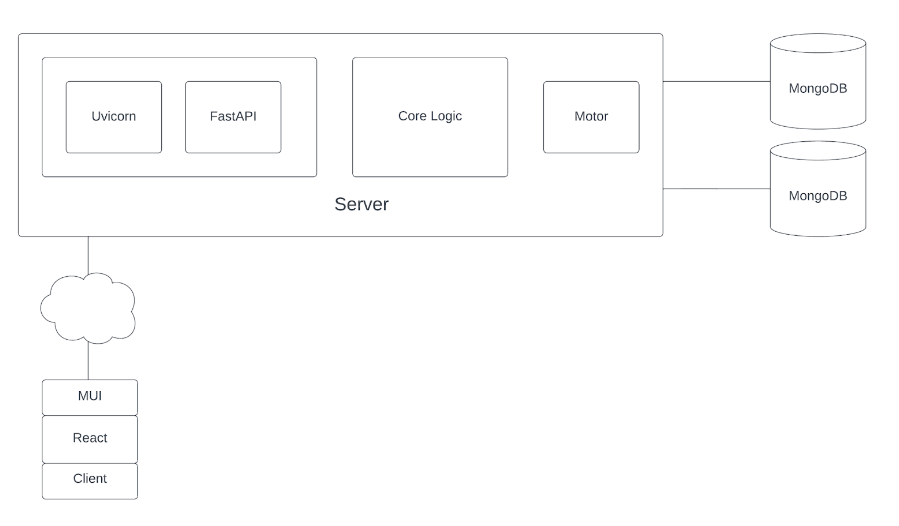

# Mongo React Warehouse Management System

## Abstract

This abstract describes a product distribution system designed for retail companies to efficiently organize their inventory across multiple warehouses. The system utilizes several cutting-edge technologies, including MongoDB, Motor MongoDB Python Driver, FastAPI, Uvicorn, React, and Material UI React. The system is designed to streamline inventory management and improve efficiency in product distribution. By using MongoDB and the Motor MongoDB Python Driver, the system can handle large amounts of data, while FastAPI and Uvicorn provide a fast and scalable backend. The frontend of the system is built using React and Material UI React, providing an intuitive and user-friendly interface. Overall, this product distribution system is a powerful tool for retail companies looking to optimize their warehouse operations.

